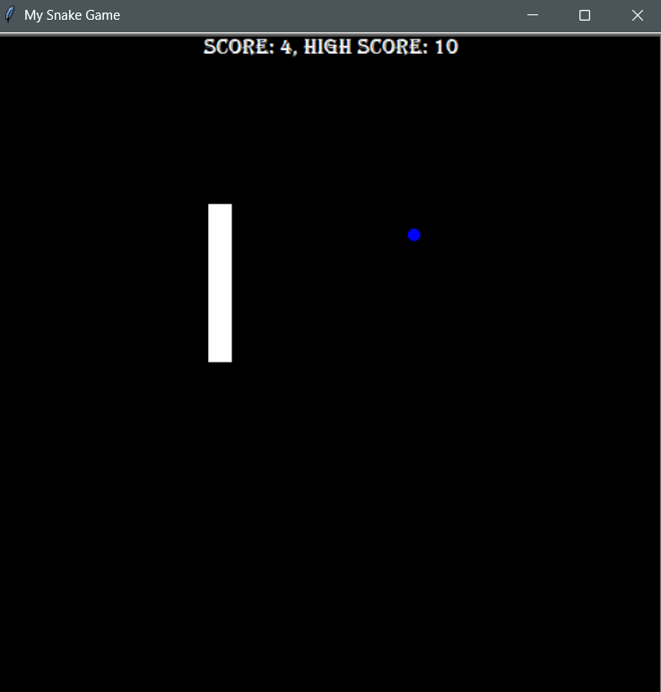

# 🐍 Snake Game

A classic Snake Game developed using **Python** and the **Pygame** library. The game offers smooth controls, real-time score tracking, randomized food generation, and collision detection, delivering an engaging arcade-style gaming experience while showcasing fundamental game development concepts.

## ✨ Features

- 🎮 Smooth keyboard controls
- 🍎 Randomized food spawning
- 📈 Real-time score tracking
- 💥 Collision detection with walls and snake body
- 🔄 Continuous game loop with restart functionality
- 🐍 Dynamic snake growth after eating food

## 🛠️ Tech Stack

- **Language:** Python
- **Library:** Pygame

## 📂 Project Structure

```
snake_game/
│── main.py          # Entry point of the game
│── snake.py         # Snake movement and logic
│── food.py          # Food generation
│── scoreboard.py    # Score management
│── data.txt         # High score storage
└── README.md
```

## 🚀 Installation

1. Clone the repository:

```bash
git clone https://github.com/lakshmidharn2007-code/snake_game.git
```

2. Navigate to the project directory:

```bash
cd snake_game
```

3. Install Pygame:

```bash
pip install pygame
```

4. Run the game:

```bash
python main.py
```

## 🎯 How to Play

- Use the **Arrow Keys** to control the snake.
- Eat food to grow the snake and increase your score.
- Avoid colliding with the walls or the snake's own body.
- Try to achieve the highest score possible!

## 📸 Screenshots



## 🤝 Contributing

Contributions are welcome! Feel free to fork the repository, create a new branch, and submit a pull request.

## 📄 License

This project is open-source and available under the **MIT License**.